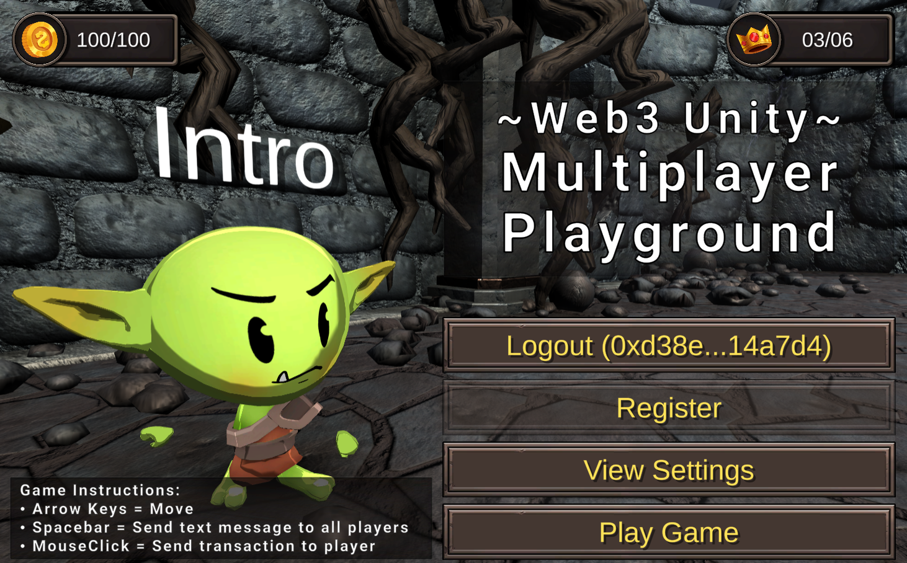
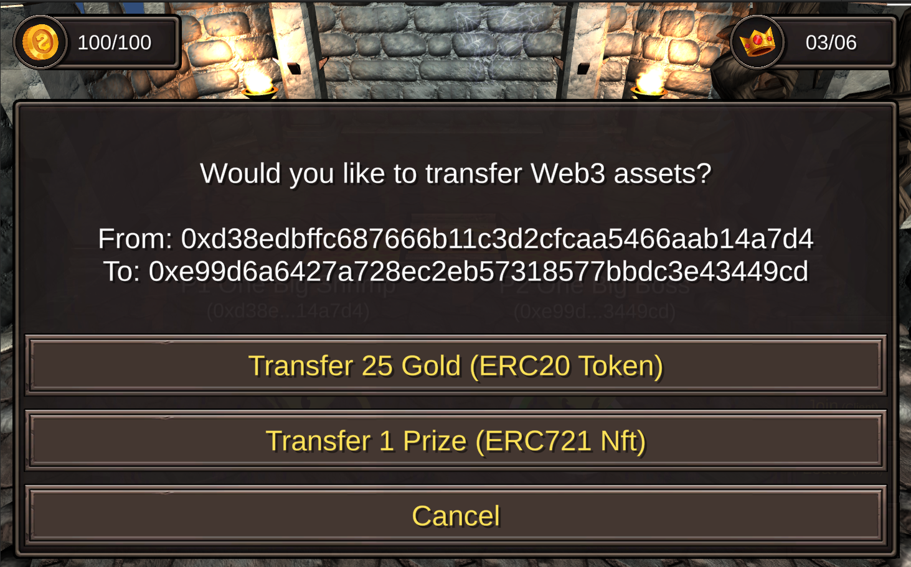
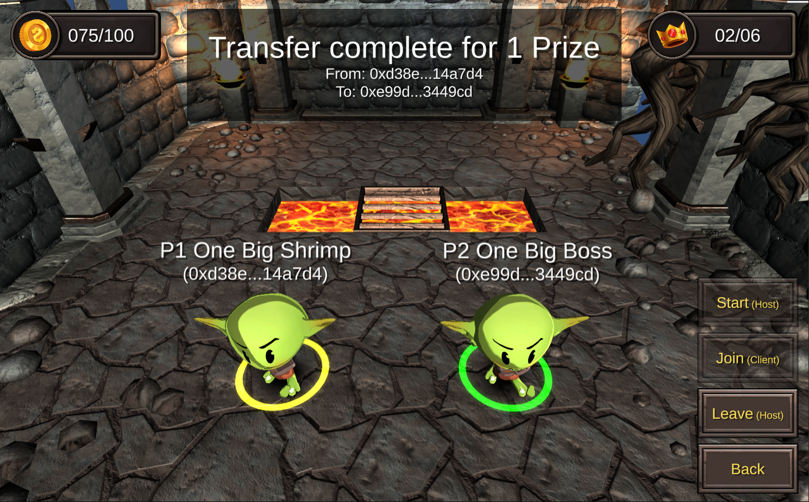
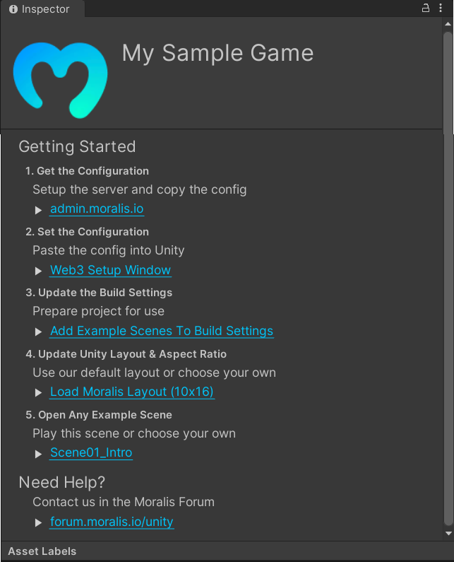
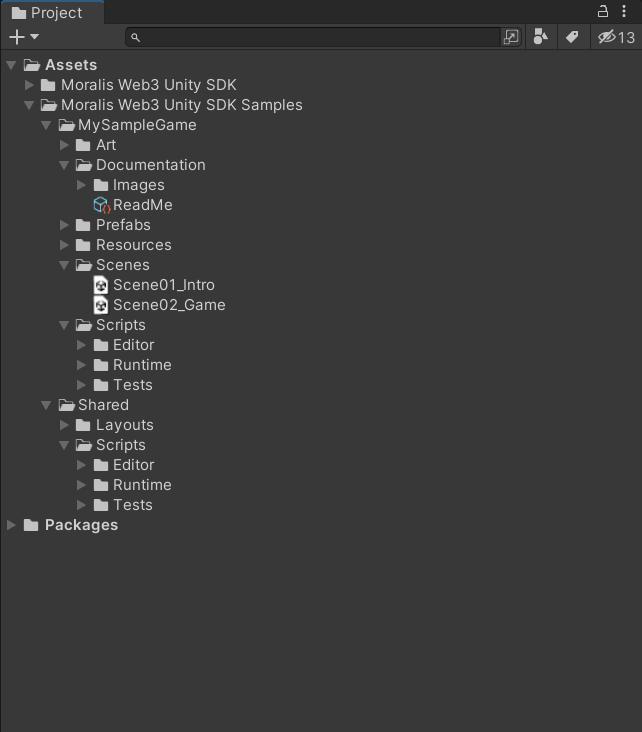
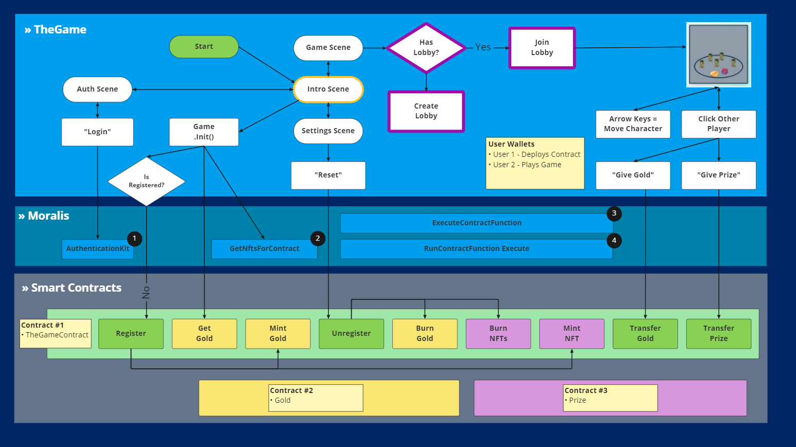
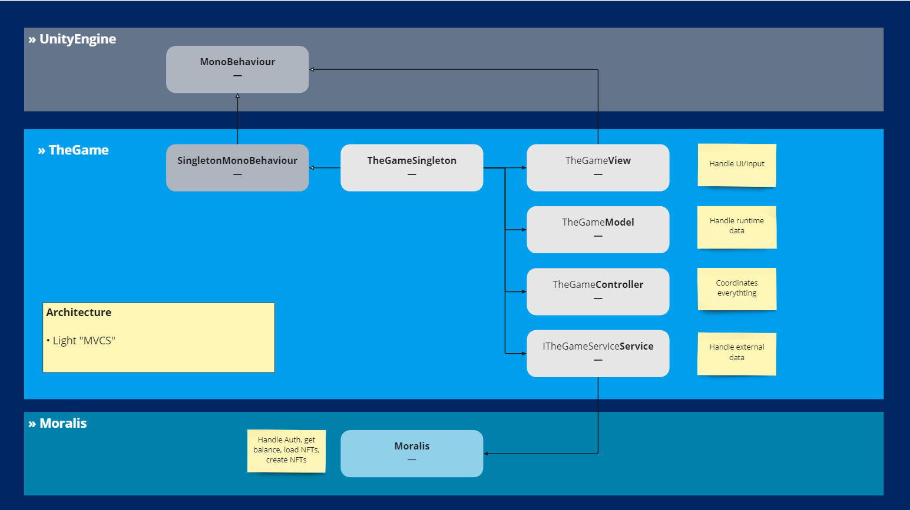
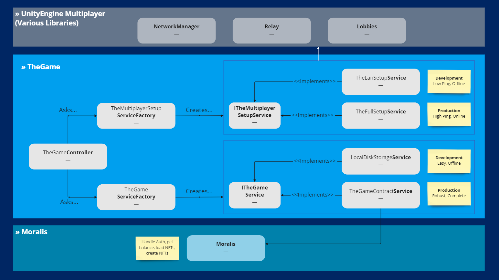
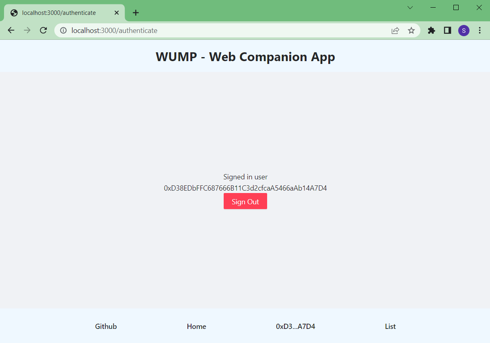
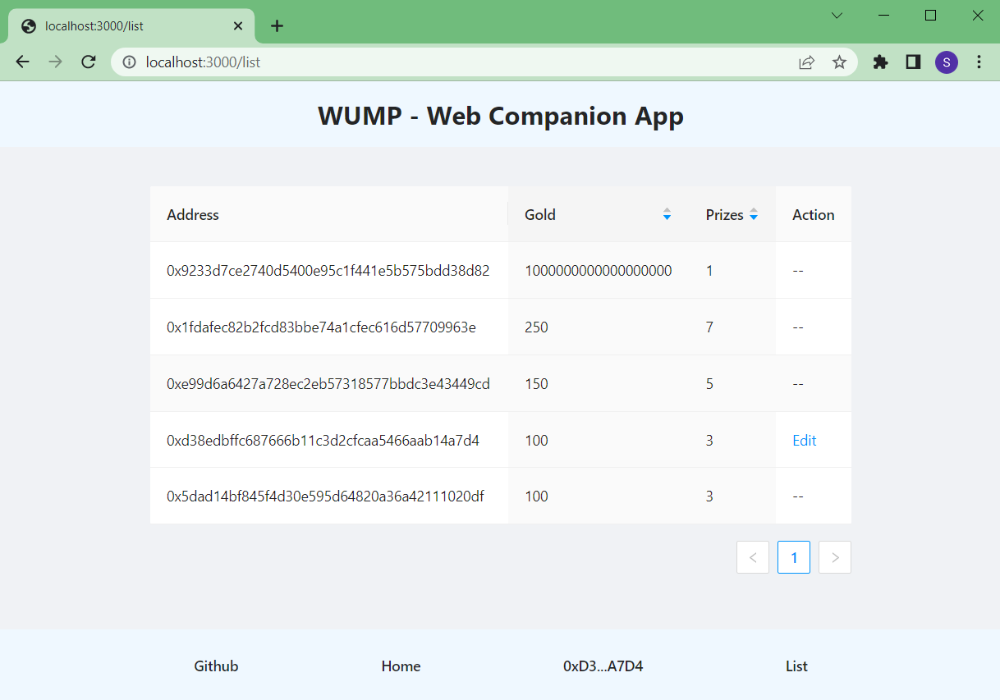

# Web3 Unity Multiplayer Playground - Sample Game

> Enter the multiplayer playground - an shared environment to move, trade currency, and trade NFTs.

This sample game demonstrates [Moralis](https://moralis.io/) Web3 Unity SDK.

**Getting Started**
1. Download this repo (*.zip or *.git)
1. Download the [Unity Editor](https://store.unity.com/#plans-individual)
1. Open this repo in the Unity Editor
1. Follow instructions at [docs.moralis.io/docs/unity-demos](https://docs.moralis.io/docs/unity-demos) for `Setup Unity` and `Setup Backend`
1. Enjoy!

See [docs.moralis.io/unity](https://docs.moralis.io/unity) for more info.

---

**Documentation**
* `README.md` - Overall Docs for this repo
* `Unity/Assets/Moralis/TheGame/Documentation/ReadMe.asset` - Unity Docs. Select this asset in Unity
* `Server/azure-playfab-functions-vscode/Instructions.txt` - Azure Docs. Deployment **required** to empower the Unity game
* `SmartContracts/Hardhat/Instructions.txt` - SmartContracts Docs. Deployment **required** to empower the Unity game
* `WebCompanionApp/NextJS/Instructions.txt` - WebCompanionApp Docs. This is optional.

**Configuration**
* `Unity Target` - [Standalone MAC/PC](https://support.unity.com/hc/en-us/articles/206336795-What-platforms-are-supported-by-Unity-)
* `Unity Version` - Use this [Version](./Unity/ProjectSettings/ProjectVersion.txt)
* `Unity Rendering` - [Universal Render Pipeline (URP)](https://docs.unity3d.com/Manual/universal-render-pipeline.html)
* `Unity Aspect Ratio` - [Game View 16x10](https://docs.unity3d.com/Manual/GameView.html)

**Structure**
* `Unity/` - Open this folder in the Unity Editor
* `Unity/Assets/Moralis/TheGame/Scenes/` - Open any Scene. Press 'Play'!

**Dependencies**
* `Already included` - Via [Unity Package Manager](https://docs.unity3d.com/Manual/upm-ui.html) as this [Version](./Unity/Packages/manifest.json)

----

## Media

 
  
**Video: Creating a Web3 Unity Multiplayer Playground**
<table>
  <tr>
    <th>Thumbnail</th>
    <th>TimeStamps</th>
  </tr>
  <tr>
    <td style="max-width:50%;" align="center"></td>
        <td align="left">
<ul>          
<li>▶ <a href="https://www.youtube.com/watch?v=9f_SG3Fib5E&t=0s">0:00</a> Intro Topic</li>
<li>▶ <a href="https://www.youtube.com/watch?v=9f_SG3Fib5E&t=51s">0:51</a> Main Topic</li>
<li>▶ <a href="https://www.youtube.com/watch?v=9f_SG3Fib5E&t=431s">7:11</a> Live Demo - Unity Sample Game </li></li>
<li>▶ <a href="https://www.youtube.com/watch?v=9f_SG3Fib5E&t=796s">13:16</a> Live Demo - Web Companion App (NextJS)</li>
<li>▶ <a href="https://www.youtube.com/watch?v=9f_SG3Fib5E&t=922s">15:22</a> Moralis Web3</li></li>
<li>▶ <a href="https://www.youtube.com/watch?v=9f_SG3Fib5E&t=987s">16:27</a> Recap Topic</li>
</ul>
    </td>
  </tr> 
</table>

 
 

**Unity Images**

<table>
  <tr>
    <th>Intro Scene</th>
    <th>4-Player Multiplayer</th>
  </tr>
  <tr>
    <td align="center"></td>
    <td align="center"></td>
  </tr> 
</table>

<table>
  <tr>
    <th>Transfer Nft</th>
    <th>Transferred Nft</th>
  </tr>
  <tr>
    <td align="center"></td>
    <td align="center"></td>
  </tr> 
</table>

<table>
  <tr>
    <th>Readme.asset</th>
    <th>TheGameConfiguration.asset</th>
  </tr>
  <tr>
    <td align="center"></td>
    <td align="center"></td>
  </tr> 
</table>

**Unity Planning Images**

<table>
  <tr>
    <th>UX Sequence Diagram</th>
    <th>UML (Light) UMVCS Architecture</th>
    <th>UML Factory Pattern</th>
  </tr>
  <tr>
    <td align="center"></td>
    <td align="center"></td>
    <td align="center"></td>
  </tr> 
</table>

**Web Companion App Images**

<table>
  <tr>
    <th>Authentication Page</th>
    <th>Players' Account Page</th>
  </tr>
  <tr>
    <td align="center"></td>
    <td align="center"></td>
  </tr> 
</table>

----

## What is Moralis?

**Moralis**

* Moralis provides a single workflow for building high performance dapps. Fully compatible with your favorite web3 tools and services. 
* See [moralis.io](https://moralis.io) for more info.

**Moralis SDK**

* This SDK brings the power of Moralis to your Unity projects. 
* See [docs.moralis.io/unity](https://docs.moralis.io/unity) for more info.

**Need Help?**

* Contact us in the Moralis Forum. 
* See [forum.moralis.io/unity](https://forum.moralis.io/unity) for more info.
